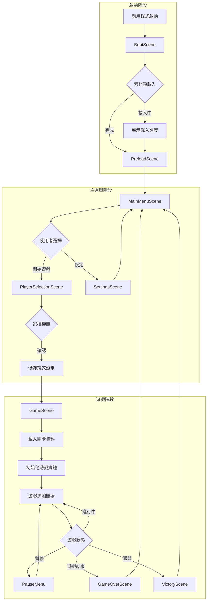
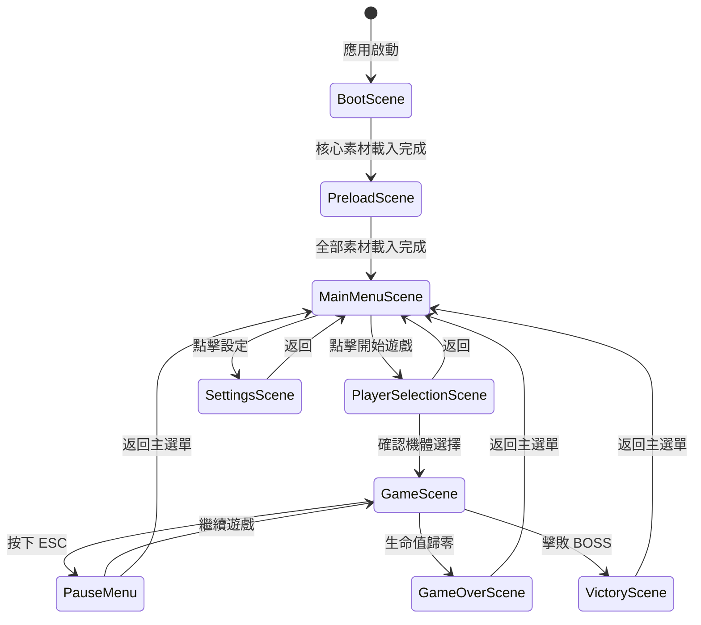
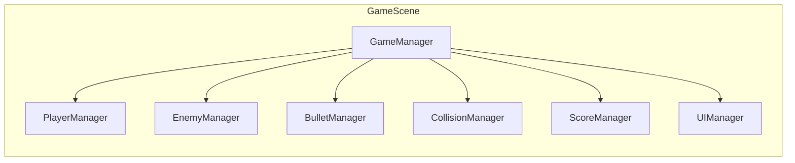

# Raiden 遊戲流程設計文件

## 一、現有架構分析

### 1.1 已發現問題

| 問題 | 位置 | 說明 |
|------|------|------|
| 容器 ID 不匹配 | `index.html:10` vs `main.tsx:12` | HTML 使用 `id="app"`，Phaser 配置使用 `parent: 'game-container'` |
| DevPanel 編譯錯誤 | `DevPanel.tsx:80` | 使用 `eventBus.emit()` 但未 import eventBus |
| 缺少 Boot/Preload 場景 | `main.tsx` | 直接進入 MainMenuScene，無載入畫面 |
| 場景資料傳遞缺失 | 各場景 | 無法傳遞玩家選擇的機體類型 |

### 1.2 現有場景結構

```
MainMenuScene (主選單)
    ↓
MainScene (遊戲主場景)
    ↓
TestLevel (測試關卡)
```

---

## 二、完整遊戲流程圖



---

## 三、場景狀態機設計



---

## 四、各階段詳細設計

### 4.1 啟動階段

#### 4.1.1 BootScene（啟動場景）

**職責：**
- 初始化 Phaser 遊戲核心
- 載入最小必要素材（載入畫面背景、進度條樣式）
- 檢測裝置相容性

**實作要點：**
```typescript
// src/scenes/BootScene.ts
export default class BootScene extends Phaser.Scene {
  preload() {
    // 載入載入畫面所需素材
    this.load.image('loading-bg', '/assets/ui/loading-bg.png');
    this.load.image('loading-bar', '/assets/ui/loading-bar.png');
  }

  create() {
    // 檢測 WebGL 支援
    if (!this.game.renderer.webGL) {
      console.warn('WebGL not supported, falling back to Canvas');
    }
    
    // 進入預載入場景
    this.scene.start('PreloadScene');
  }
}
```

#### 4.1.2 PreloadScene（預載入場景）

**職責：**
- 載入所有遊戲素材
- 顯示載入進度
- 處理載入錯誤

**素材載入策略：**

| 優先級 | 素材類型 | 載入時機 |
|--------|----------|----------|
| P0 | UI 元件、字體 | BootScene |
| P1 | 玩家機體、子彈 | PreloadScene |
| P2 | 敵機、BOSS | PreloadScene |
| P3 | 關卡背景 | 關卡載入時 |
| P4 | 音效、音樂 | 按需載入 |

**實作要點：**
```typescript
// src/scenes/PreloadScene.ts
export default class PreloadScene extends Phaser.Scene {
  private progressBar!: Phaser.GameObjects.Graphics;
  private progressBox!: Phaser.GameObjects.Graphics;
  private loadingText!: Phaser.GameObjects.Text;

  preload() {
    this.createLoadingUI();
    this.setupLoadEvents();
    this.loadAllAssets();
  }

  private createLoadingUI() {
    const width = this.cameras.main.width;
    const height = this.cameras.main.height;
    
    // 進度條外框
    this.progressBox = this.add.graphics();
    this.progressBox.fillStyle(0x222222, 0.8);
    this.progressBox.fillRect(width / 2 - 160, height / 2 - 25, 320, 50);
    
    // 進度條
    this.progressBar = this.add.graphics();
    
    // 載入文字
    this.loadingText = this.add.text(width / 2, height / 2 - 50, '載入中...', {
      font: '20px Arial',
      color: '#ffffff'
    }).setOrigin(0.5);
  }

  private setupLoadEvents() {
    this.load.on('progress', (value: number) => {
      this.progressBar.clear();
      this.progressBar.fillStyle(0xffcc00, 1);
      this.progressBar.fillRect(
        this.cameras.main.width / 2 - 150,
        this.cameras.main.height / 2 - 15,
        300 * value,
        30
      );
      this.loadingText.setText(`載入中... ${Math.floor(value * 100)}%`);
    });

    this.load.on('complete', () => {
      this.progressBar.destroy();
      this.progressBox.destroy();
      this.loadingText.destroy();
    });
  }

  private loadAllAssets() {
    // 載入玩家機體
    this.loadPlayerAssets();
    // 載入敵機
    this.loadEnemyAssets();
    // 載入 UI
    this.loadUIAssets();
    // 載入音效
    this.loadAudioAssets();
  }

  create() {
    this.scene.start('MainMenuScene');
  }
}
```

---

### 4.2 主選單階段

#### 4.2.1 MainMenuScene（主選單場景）

**職責：**
- 顯示遊戲標題
- 提供選單選項（開始遊戲、設定、離開）
- 背景動畫效果

**選單選項：**
1. **開始遊戲** → 進入 PlayerSelectionScene
2. **設定** → 進入 SettingsScene
3. **離開** → 關閉遊戲（Web 版顯示提示）

**改進建議：**
- 移除現有的 PLAYER 1 / PLAYER 2 按鈕
- 改為統一的「開始遊戲」入口
- 玩家數量與機體選擇在 PlayerSelectionScene 處理

#### 4.2.2 PlayerSelectionScene（機體選擇場景）

**職責：**
- 選擇玩家數量（1P / 2P）
- 選擇機體類型（6 種機體）
- 顯示機體屬性預覽

**機體清單：**
| 機體名稱 | 特性 | 素材路徑 |
|----------|------|----------|
| Raiden-1P | 基礎型 | `/assets/players/Raiden-1P/` |
| Raiden-2P | 基礎型 | `/assets/players/Raiden-2P/` |
| Raiden-MKII-1P | 強化型 | `/assets/players/Raiden-MKII-1P/` |
| Raiden-MKII-2P | 強化型 | `/assets/players/Raiden-MKII-2P/` |
| Raiden-MADshark-1P | 特殊型 | `/assets/players/Raiden-MADshark-1P/` |

**資料結構：**
```typescript
// src/types/player.ts
interface PlayerConfig {
  id: string;
  name: string;
  type: '1P' | '2P';
  stats: {
    speed: number;
    fireRate: number;
    damage: number;
    health: number;
  };
  spriteKey: string;
  atlasPath: string;
}

interface GameSetupData {
  playerCount: 1 | 2;
  players: PlayerConfig[];
  difficulty: 'easy' | 'normal' | 'hard';
}
```

#### 4.2.3 SettingsScene（設定場景）

**職責：**
- 音量調整（BGM、SFX）
- 難度設定
- 按鍵配置
- 畫面設定

---

### 4.3 遊戲階段

#### 4.3.1 GameScene（遊戲主場景）

**職責：**
- 管理遊戲迴圈
- 協調各子系統
- 處理遊戲狀態

**子系統架構：**



**遊戲迴圈流程：**
```typescript
// src/scenes/GameScene.ts
export default class GameScene extends Phaser.Scene {
  private gameManager!: GameManager;
  
  create(data: GameSetupData) {
    // 初始化遊戲管理器
    this.gameManager = new GameManager(this, data);
    this.gameManager.initialize();
    
    // 設定碰撞群組
    this.setupCollisionGroups();
    
    // 啟動遊戲迴圈
    this.gameManager.start();
  }

  update(time: number, delta: number) {
    if (this.gameManager.isPaused) return;
    this.gameManager.update(delta);
  }

  private setupCollisionGroups() {
    // 玩家子彈 vs 敵機
    // 敵機子彈 vs 玩家
    // 玩家 vs 敵機
    // 玩家 vs 道具
  }
}
```

#### 4.3.2 遊戲 UI 系統

**HUD 元件：**
- 分數顯示
- 生命值/血條
- 武器狀態
- 炸彈數量
- 關卡進度

**實作方式：**
```typescript
// src/systems/UIManager.ts
export class UIManager {
  private scene: Phaser.Scene;
  private scoreText!: Phaser.GameObjects.Text;
  private healthBar!: Phaser.GameObjects.Graphics;
  private weaponIndicator!: Phaser.GameObjects.Container;

  constructor(scene: Phaser.Scene) {
    this.scene = scene;
    this.createHUD();
  }

  private createHUD() {
    // 分數
    this.scoreText = this.scene.add.text(16, 16, 'SCORE: 0', {
      fontSize: '24px',
      color: '#ffffff',
      stroke: '#000000',
      strokeThickness: 4
    }).setScrollFactor(0).setDepth(100);

    // 生命值條
    this.createHealthBar();
    
    // 武器指示器
    this.createWeaponIndicator();
  }

  updateScore(score: number) {
    this.scoreText.setText(`SCORE: ${score.toLocaleString()}`);
  }

  updateHealth(current: number, max: number) {
    // 更新血條顯示
  }
}
```

---

### 4.4 場景切換機制

#### 4.4.1 場景管理器

**職責：**
- 統一管理場景切換
- 處理場景間資料傳遞
- 提供場景過渡效果

```typescript
// src/systems/SceneManager.ts
export class SceneManager {
  private game: Phaser.Game;
  private currentScene: string;

  constructor(game: Phaser.Game) {
    this.game = game;
    this.currentScene = 'BootScene';
  }

  transitionTo(sceneKey: string, data?: any) {
    // 淡出當前場景
    this.game.scene.getScene(this.currentScene).cameras.main.fadeOut(300);
    
    // 切換場景
    this.game.scene.start(sceneKey, data);
    this.currentScene = sceneKey;
    
    // 淡入新場景
    this.game.scene.getScene(sceneKey).cameras.main.fadeIn(300);
  }

  pauseCurrentScene() {
    this.game.scene.pause(this.currentScene);
  }

  resumeCurrentScene() {
    this.game.scene.resume(this.currentScene);
  }
}
```

#### 4.4.2 場景資料傳遞

**使用 Phaser 內建機制：**
```typescript
// 傳送資料
this.scene.start('GameScene', {
  playerCount: 1,
  players: [selectedPlayer],
  difficulty: 'normal'
});

// 接收資料
create(data: GameSetupData) {
  console.log('Player count:', data.playerCount);
  console.log('Selected players:', data.players);
}
```

#### 4.4.3 全局遊戲狀態

```typescript
// src/stores/gameStore.ts
export class GameStore {
  private static instance: GameStore;
  
  // 遊戲設定
  public playerCount: 1 | 2 = 1;
  public selectedPlayers: PlayerConfig[] = [];
  public difficulty: 'easy' | 'normal' | 'hard' = 'normal';
  
  // 遊戲進度
  public currentScore: number = 0;
  public currentLevel: number = 1;
  public highScore: number = 0;

  static getInstance(): GameStore {
    if (!GameStore.instance) {
      GameStore.instance = new GameStore();
    }
    return GameStore.instance;
  }

  reset() {
    this.currentScore = 0;
    this.currentLevel = 1;
  }
}
```

---

## 五、需要新增/修改的檔案清單

### 5.1 必須修改的檔案

| 檔案 | 問題 | 修改內容 |
|------|------|----------|
| `index.html` | 容器 ID 不匹配 | 將 `id="app"` 改為 `id="game-container"` |
| `src/components/DevPanel/DevPanel.tsx` | 缺少 import | 新增 `import { eventBus } from '../utils/EventBus';` |
| `src/main.tsx` | 缺少 Boot/Preload 場景 | 更新場景列表 |

### 5.2 需要新增的檔案

| 檔案路徑 | 用途 |
|----------|------|
| `src/scenes/BootScene.ts` | 啟動場景 |
| `src/scenes/PreloadScene.ts` | 預載入場景 |
| `src/scenes/PlayerSelectionScene.ts` | 機體選擇場景 |
| `src/scenes/SettingsScene.ts` | 設定場景 |
| `src/scenes/GameScene.ts` | 遊戲主場景（重構 MainScene） |
| `src/scenes/PauseMenu.ts` | 暫停選單 |
| `src/scenes/GameOverScene.ts` | 遊戲結束場景 |
| `src/scenes/VictoryScene.ts` | 通關場景 |
| `src/systems/GameManager.ts` | 遊戲管理器 |
| `src/systems/PlayerManager.ts` | 玩家管理器 |
| `src/systems/EnemyManager.ts` | 敵機管理器 |
| `src/systems/BulletManager.ts` | 子彈管理器 |
| `src/systems/ScoreManager.ts` | 分數管理器 |
| `src/systems/UIManager.ts` | UI 管理器 |
| `src/stores/gameStore.ts` | 全局遊戲狀態 |
| `src/types/player.ts` | 玩家類型定義 |
| `src/types/game.ts` | 遊戲類型定義 |

### 5.3 需要重構的檔案

| 檔案 | 重構內容 |
|------|----------|
| `src/scenes/MainMenuScene.ts` | 簡化選單，移除玩家選擇邏輯 |
| `src/scenes/MainScene.ts` | 整合到 GameScene |
| `src/scenes/TestLevel.ts` | 整合到 GameScene 作為關卡模板 |

---

## 六、實作優先順序建議

### Phase 1: 修復關鍵問題（必須先完成）

1. **修復容器 ID 不匹配**
   - 修改 `index.html` 的 `id="app"` 為 `id="game-container"`
   - 或修改 `main.tsx` 的 `parent: 'game-container'` 為 `parent: 'app'`

2. **修復 DevPanel 編譯錯誤**
   - 在 `DevPanel.tsx` 頂部新增 `import { eventBus } from '../utils/EventBus';`

### Phase 2: 啟動階段實作

3. **建立 BootScene**
   - 初始化遊戲核心
   - 載入最小素材

4. **建立 PreloadScene**
   - 實作載入進度條
   - 載入所有遊戲素材

5. **更新 main.tsx 場景列表**
   - 新增 BootScene、PreloadScene 到場景列表

### Phase 3: 主選單階段實作

6. **重構 MainMenuScene**
   - 簡化選單結構
   - 新增設定入口

7. **建立 PlayerSelectionScene**
   - 實作機體選擇 UI
   - 實作機體屬性預覽

8. **建立 SettingsScene**
   - 音量控制
   - 難度設定

### Phase 4: 遊戲階段實作

9. **建立 GameManager**
   - 遊戲狀態管理
   - 子系統協調

10. **建立各子系統**
    - PlayerManager
    - EnemyManager
    - BulletManager
    - ScoreManager
    - UIManager

11. **建立 GameScene**
    - 整合所有子系統
    - 實作遊戲迴圈

### Phase 5: 完善遊戲流程

12. **建立 PauseMenu**
    - 暫停/繼續功能
    - 返回主選單

13. **建立 GameOverScene / VictoryScene**
    - 結算畫面
    - 分數顯示

---

## 七、附錄：完整場景列表

```
BootScene          # 啟動場景
PreloadScene       # 預載入場景
MainMenuScene      # 主選單
PlayerSelectionScene  # 機體選擇
SettingsScene      # 設定選單
GameScene          # 遊戲主場景
PauseMenu          # 暫停選單（疊加在 GameScene 上）
GameOverScene      # 遊戲結束
VictoryScene       # 通關畫面
```

---

## 八、版本資訊

- **建立日期**：2026-02-25
- **版本**：v1.0
- **作者**：Roo Architect Mode
