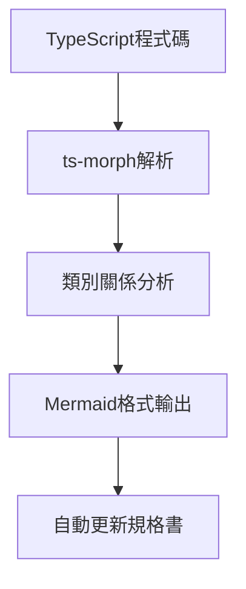
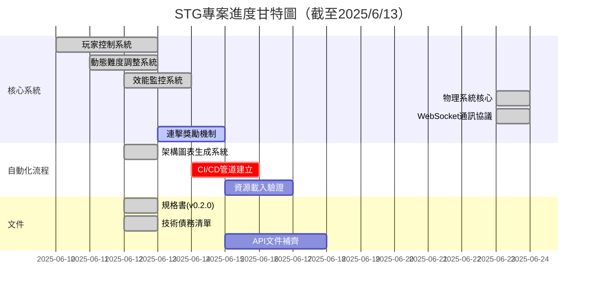

## 架構圖表生成系統實作報告

### 1. 功能概述


### 2. 技術決策
- 使用ts-morph進行AST解析
- 整合至現有CI/CD流程
- 採用Mermaid.js標準化圖表格式

### 3. 版本更新記錄
```markdown
### [v0.4.0] - 2025-06-23
- 新增物理系統核心模組 (PhysicsSystem)
- 實作WebSocket雙向通訊協議
- 更新規格書至v1.2.0

### [v0.3.0] - 2025-06-12
- 新增偽3D技術規範文件
- 建立3D遷移計畫架構圖
- 更新規格書至v0.2.0

### [v0.2.0] - 2025-06-12
- 新增自動化架構圖表生成
- 更新TypeScript至5.2.2
- 補齊效能監控系統測試案例
```

### 4. 專案進度報告


### 5. 自動化驗證
```powershell
npm run gen:diagrams && npm test

### [2025-06-23] 開發日誌
- 實作PhysicsSystem碰撞檢測模組
- 整合WebSocketClient至主場景
- 新增網路通訊單元測試案例

### [2025-06-13] 開發日誌
- 新增偽3D透視系統架構
- 完成資源目錄結構規劃
  - 建立分層卷軸專用目錄
  - 更新規格書資源管理規範
- 整合透視系統與現有效能監控