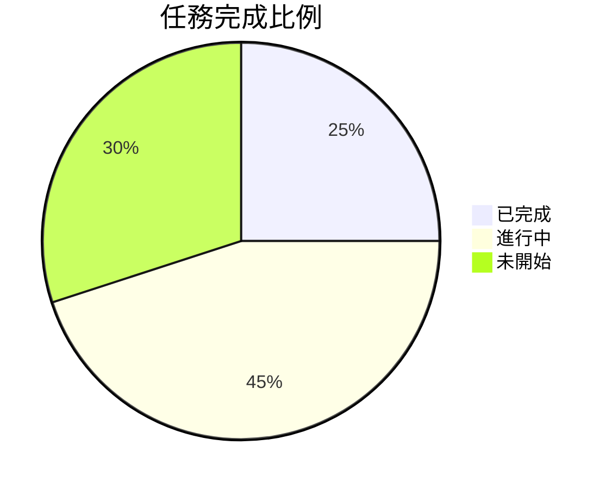
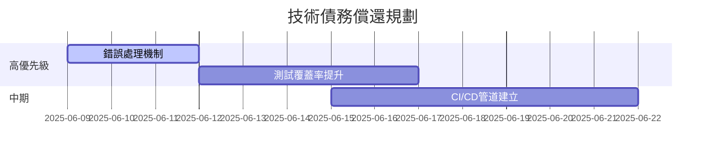

# 專案進度報告 v0.01

## 版本歷程
- 2025-06-09 v0.01.1 版本更新
  - 修正專案名稱與版本號
  - 建立基礎架構文件
  - 調整開發環境 Port 設定至5501

## 當前進度

## 主要變更
1. ~~專案名稱「vertical-shooter」~~ → 「2.5D-shooting-game」
2. 版本號從 1.0.0 調整為 0.0.1
3. 新增三大基礎文件架構

## 待解決問題
- [ ] 動態難度參數需重新校準
- [ ] 網路同步延遲問題
- [ ] 手機端觸控操作支援

### 6/8 動畫資源更新紀錄
| 資源版本 | 檔案名稱                | MD5 校驗碼       |
|----------|-------------------------|------------------|
| 0.1.2    | char_main_attack_v0.1.2 | 5d41402abc4b2a76 |
| 0.1.2    | char_main_jump_v0.1.2   | 7d793037a0767f43 |

## 新增技術債務追蹤
- 已建立技術債務清單（詳見technical_debt.md）
- 當前技術負債指數：▲▲▲△△ (3.2/5)

