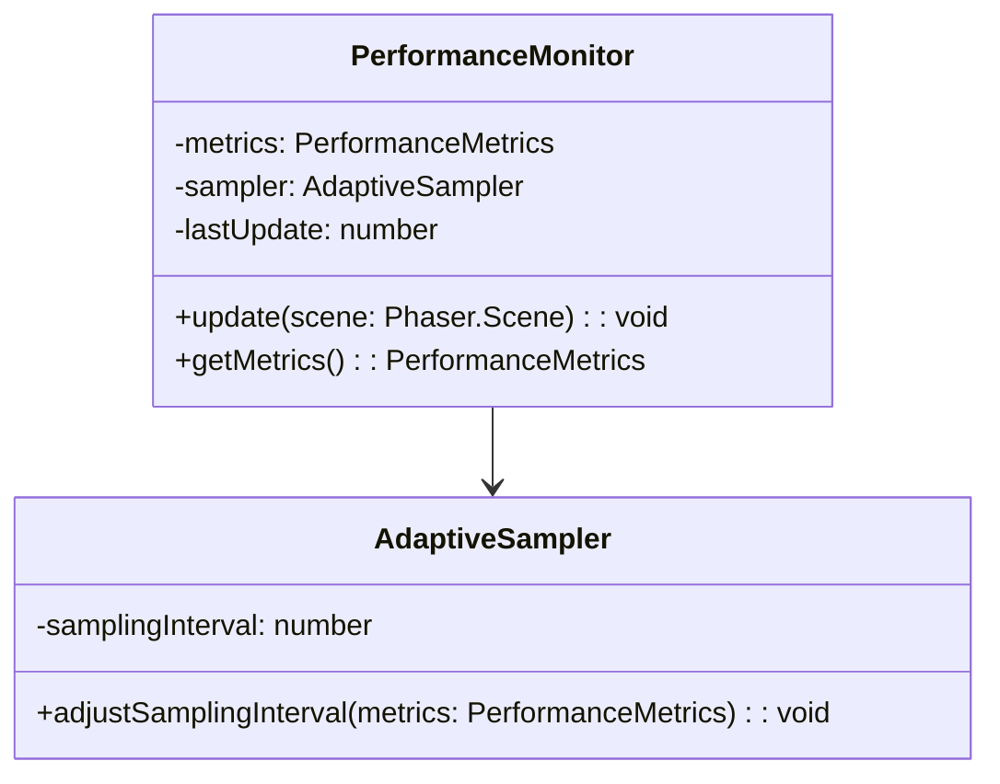
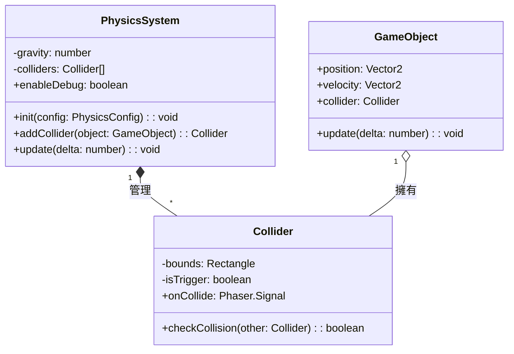
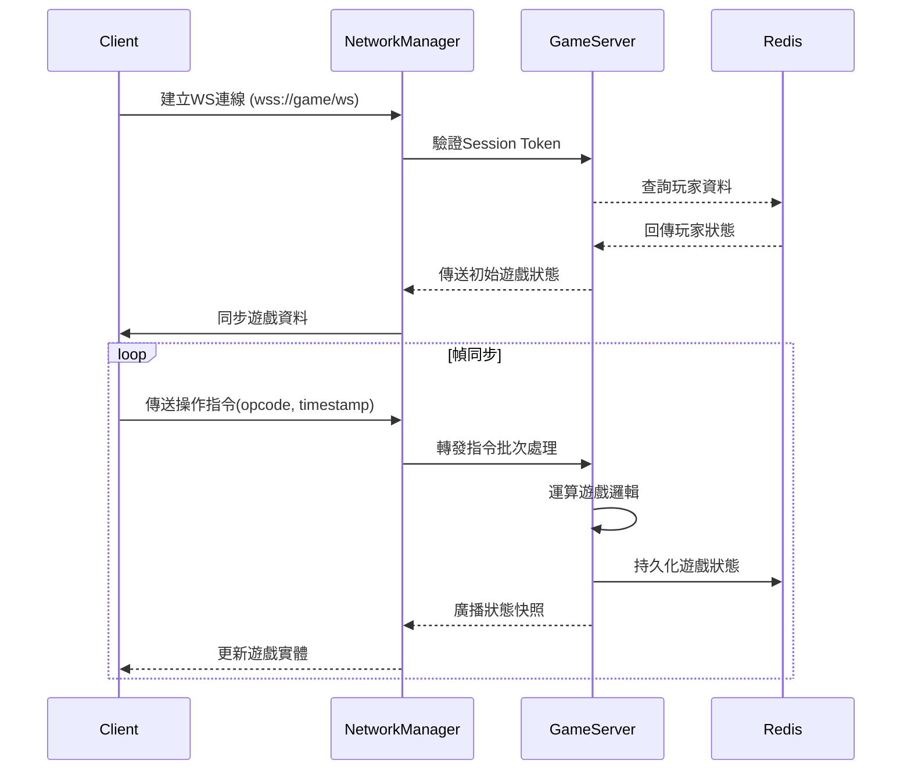
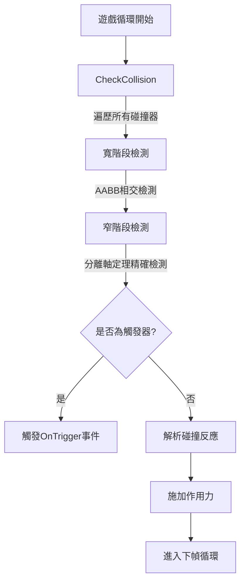

# 專案規格書 v1.2.2
<!-- 2025-06-23 完整補齊物理系統與WebSocket章節 -->

## 架構圖表


## 物理系統類別圖補充


## WebSocket通訊時序圖加強


## 碰撞檢測活動圖


## 3.2 角色動畫規範
- **骨骼動畫參數**
  - 最大骨骼數：48
  - 幀間插值：貝茲曲線緩動
- **幀率限制**
  ```mermaid
  flowchart LR
      A[動畫類型] -->|過場動畫| B[30 FPS]
      A -->|戰鬥動畫| C[60 FPS]
  ```
- **資源命名規則**
  - 主角動畫：`char_main_{動作名稱}_v{版本號}`
  - 版本號格式：`0.1.2 → MAJOR.MINOR.PATCH`
  - 影格命名：`Raiden-1P (圖層 {序號}).aseprite`


## 版本變更履歷
| 版本   | 更新內容               | 負責人 | 日期       |
|--------|----------------------|--------|------------|
| v1.2.2 | 補齊物理系統與WebSocket章節 | Roo    | 2025-06-23 |
| v1.2.1 | 文件異常狀態修復           | Roo    | 2025-06-23 |
| v1.2.0 | 物理系統與網路層基礎架構   | Roo    | 2025-06-23 |
| v1.1.0 | 架構重構與等角系統整合     | Roo    | 2025-06-21 |