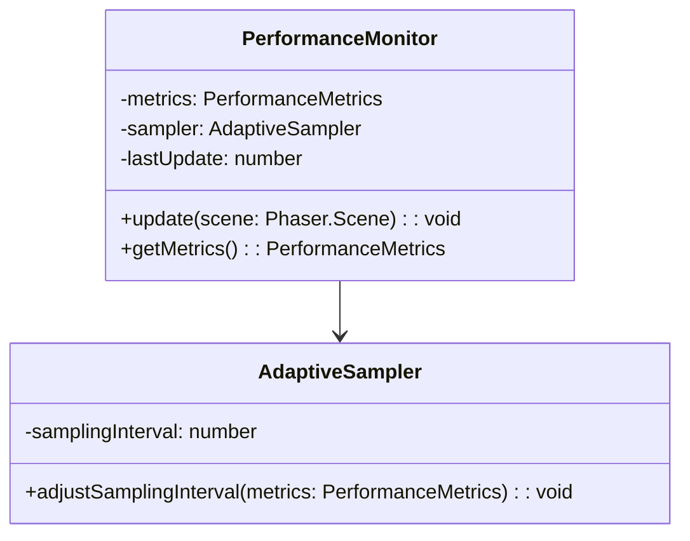
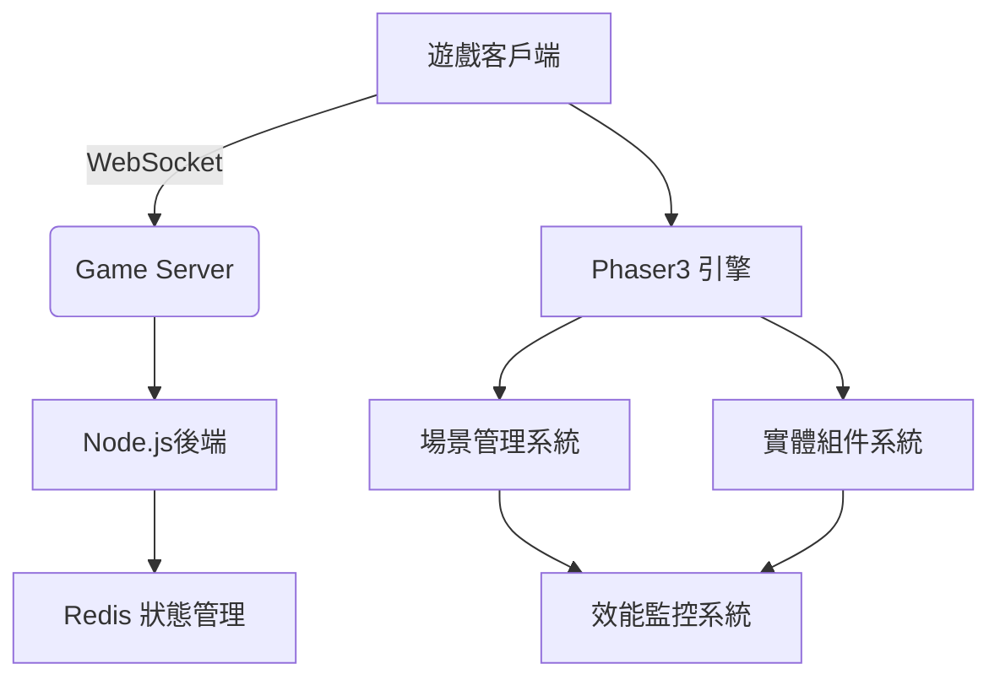

# 專案規格書 v0.2.1
<!-- 2025-06-21 更新：v0.2.1 新增WebSocket實作細節 -->

## 架構圖表

- 預設網址：http://localhost:5501
- 執行指令：`npm run dev`

## 技術選型
- 遊戲引擎：Phaser.js 3.70
- 渲染模式：Canvas + WebGL 雙模式自動切換
- 物理引擎：Arcade Physics (內建)
- 跨平台支援：Web/Electron/Cordova
- 網路傳輸：WebSocket 雙向即時通訊
  ```mermaid
  sequenceDiagram
    Client->>Server: 建立WS連線 (wss://game.example.com/ws)
    Server-->>Client: 發送初始遊戲狀態
    loop 幀同步
        Client->>Server: 傳送操作指令
        Server-->>Client: 廣播遊戲狀態
    end
  ```
- 連線保活機制：
  - 心跳間隔：30秒
  - 逾時重試次數：3次
- 資源目錄規範：
  - sprites: 角色/物件動畫圖集
  - parallax:
    - background: 遠景卷軸
    - midground: 中景動態元素
    - foreground: 近景裝飾物件

## 技術架構


## 核心功能
1. 玩家戰機控制系統
2. 敵方AI行為樹
3. 動態難度調整系統
4. 連擊獎勵機制

## 開發規範
1. 使用 **Airbnb TypeScript 風格指南**
2. 函式命名採駝峰式(camelCase)
3. 所有公開方法需包含 JSDoc 註解
4. 單元測試覆蓋率需達 80% 以上

## 版本控制
- 格式規範：遵循[語意化版本 2.0.0](https://semver.org/lang/zh-TW/)
- 變更紀錄格式：
  ```markdown
  ### [版本號] - YYYY-MM-DD
  #### 新增
  - 項目描述
  #### 變更
  - 項目描述
  #### 修復
  - 項目描述
  ```

## 3.2 角色動畫規範
- **骨骼動畫參數**
  - 最大骨骼數：48
  - 幀間插值：貝茲曲線緩動
- **幀率限制**
  ```mermaid
  flowchart LR
      A[動畫類型] -->|過場動畫| B[30 FPS]
      A -->|戰鬥動畫| C[60 FPS]
  ```
- **資源命名規則**
  - 主角動畫：`char_main_{動作名稱}_v{版本號}`
  - 版本號格式：`0.1.2 → MAJOR.MINOR.PATCH`
  - 影格命名：`Raiden-1P (圖層 {序號}).aseprite`
  
## 版本變更履歷
| 版本   | 更新內容               | 負責人 | 日期       |
|--------|----------------------|--------|------------|
| v0.2.0 | 新增類別圖與狀態機圖   | Roo    | 2025-06-12 |

## 測試案例要求
```typescript
// 範例測試案例
describe('PlayerController', () => {
  test('應正確處理方向輸入', () => {
    const player = new Player();
    player.handleInput('right');
    expect(player.velocity.x).toBe(5);
  });
});