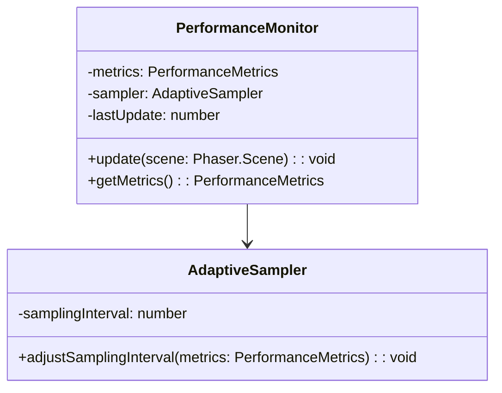
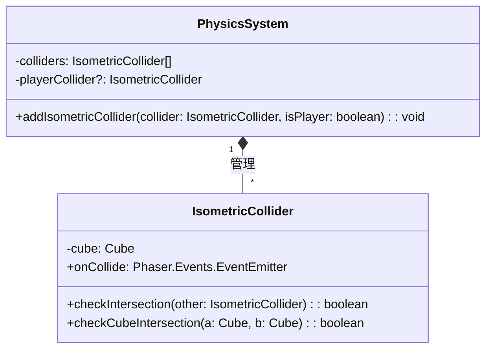
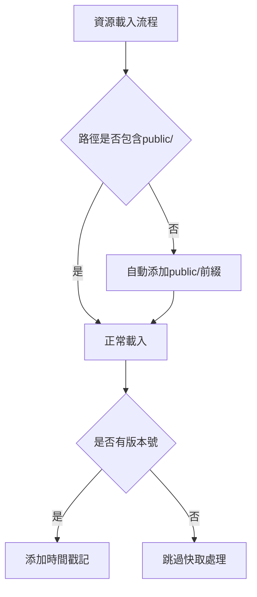
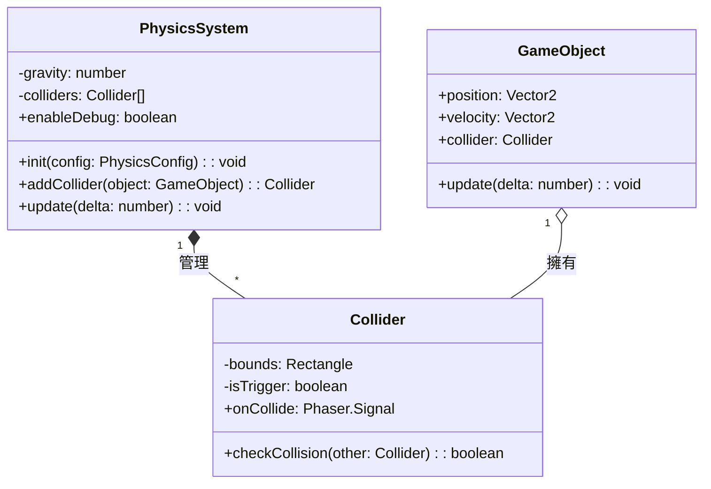
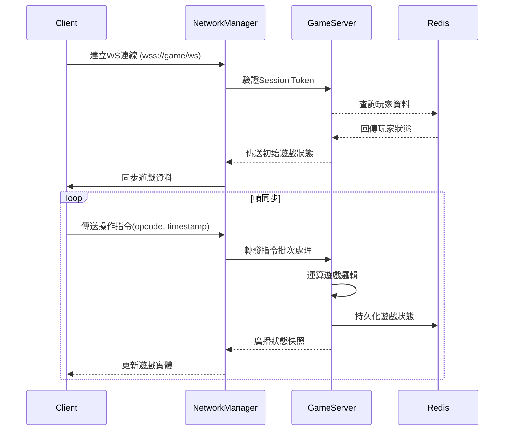
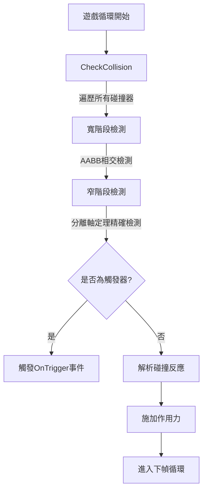
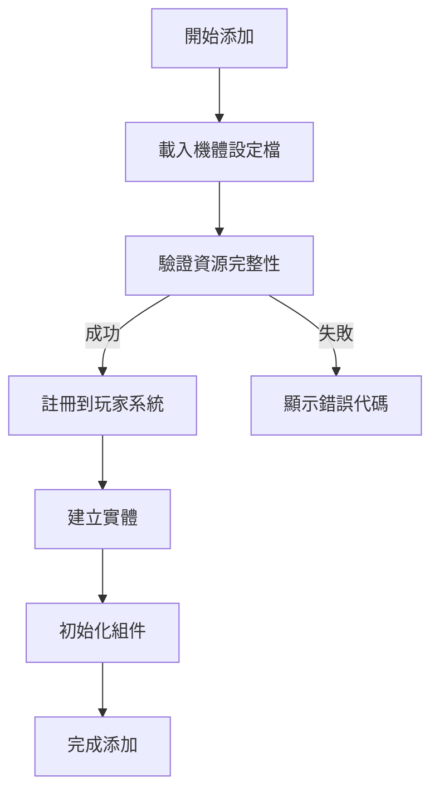
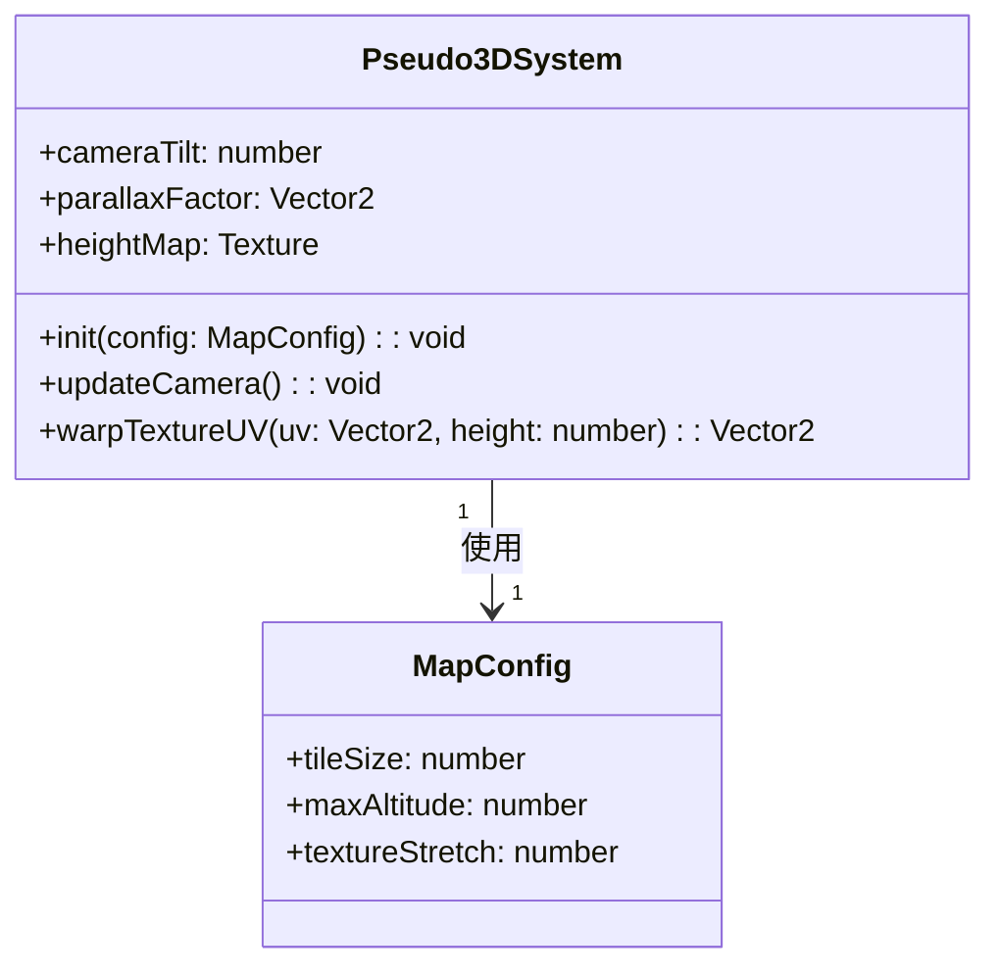
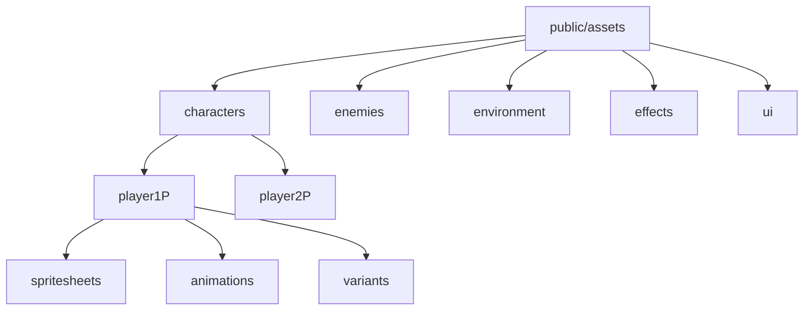

# 專案規格書 v1.4.0
<!-- 2025-10-31 新增自機添加系統規範 -->

## 架構圖表

```mermaid
classDiagram
  class PerformanceMonitor {
    -metrics: PerformanceMetrics
    -sampler: AdaptiveSampler
    -lastUpdate: number
    +update(scene: Phaser.Scene): void
    +getMetrics(): PerformanceMetrics
  }

  class AdaptiveSampler {
    -samplingInterval: number
    +adjustSamplingInterval(metrics: PerformanceMetrics): void
  }

  PerformanceMonitor --> AdaptiveSampler
```

## 等角投影碰撞系統規範 v1.2.3 (2025-06-26)

```mermaid
classDiagram
    class IsometricCollider {
        -cube: Cube
        +onCollide: Phaser.Events.EventEmitter
        +checkIntersection(other: IsometricCollider): boolean
        +checkCubeIntersection(a: Cube, b: Cube): boolean
    }

    class PhysicsSystem {
        -colliders: IsometricCollider[]
        -playerCollider?: IsometricCollider
        +addIsometricCollider(collider: IsometricCollider, isPlayer: boolean): void
    }

    PhysicsSystem "1" *-- "*" IsometricCollider : 管理
```

## 資源加載規範 v1.2.3 (2025-06-26)

```mermaid
flowchart TD
    Load[資源載入流程] --> PathCheck{路徑是否包含public/}
    PathCheck -->|是| NormalLoad[正常載入]
    PathCheck -->|否| Prepend[自動添加public/前綴]
    Prepend --> NormalLoad
    NormalLoad --> VersionCheck{是否有版本號}
    VersionCheck -->|是| CacheBust[添加時間戳記]
    VersionCheck -->|否| SkipCache[跳過快取處理]
```

## 物理系統類別圖補充

```mermaid
classDiagram
    class PhysicsSystem {
        -gravity: number
        -colliders: Collider[]
        +enableDebug: boolean
        +init(config: PhysicsConfig): void
        +addCollider(object: GameObject): Collider
        +update(delta: number): void
    }

    class Collider {
        -bounds: Rectangle
        -isTrigger: boolean
        +onCollide: Phaser.Signal
        +checkCollision(other: Collider): boolean
    }

    class GameObject {
        +position: Vector2
        +velocity: Vector2
        +collider: Collider
        +update(delta: number): void
    }

    PhysicsSystem "1" *-- "*" Collider : 管理
    GameObject "1" o-- "1" Collider : 擁有
```

## WebSocket通訊時序圖加強

```mermaid
sequenceDiagram
    participant Client
    participant NetworkManager
    participant GameServer
    participant Redis

    Client->>NetworkManager: 建立WS連線 (wss://game/ws)
    NetworkManager->>GameServer: 驗證Session Token
    GameServer-->>Redis: 查詢玩家資料
    Redis-->>GameServer: 回傳玩家狀態
    GameServer-->>NetworkManager: 傳送初始遊戲狀態
    NetworkManager->>Client: 同步遊戲資料
    loop 幀同步
        Client->>NetworkManager: 傳送操作指令(opcode, timestamp)
        NetworkManager->>GameServer: 轉發指令批次處理
        GameServer->>GameServer: 運算遊戲邏輯
        GameServer->>Redis: 持久化遊戲狀態
        GameServer-->>NetworkManager: 廣播狀態快照
        NetworkManager-->>Client: 更新遊戲實體
    end
```

## 碰撞檢測活動圖

```mermaid
flowchart TD
    Start[遊戲循環開始] --> CheckCollision
    CheckCollision -->|遍歷所有碰撞器| BroadPhase[寬階段檢測]
    BroadPhase -->|AABB相交檢測| NarrowPhase[窄階段檢測]
    NarrowPhase -->|分離軸定理精確檢測| TriggerCheck{是否為觸發器?}
    TriggerCheck -->|是| FireEvent[觸發OnTrigger事件]
    TriggerCheck -->|否| Resolve[解析碰撞反應]
    Resolve --> ApplyForce[施加作用力]
    ApplyForce --> End[進入下幀循環]
```

## 3.2 自機添加系統規範

```mermaid
flowchart TD
    Start[開始添加] --> LoadConfig[載入機體設定檔]
    LoadConfig --> Validate[驗證資源完整性]
    Validate -->|成功| Register[註冊到玩家系統]
    Validate -->|失敗| Error[顯示錯誤代碼]
    Register --> Create[建立實體]
    Create --> Init[初始化組件]
    Init --> Done[完成添加]
```

**API使用範例：**
```typescript
// 從玩家選擇畫面添加自機
function addPlayerShip(shipData: ShipConfig) {
  const loader = new AssetScanner();
  const isValid = loader.validateShipAssets(shipData);
  
  if (isValid) {
    const ship = new PlayerShip(scene, shipData);
    ship.registerInput();
    ship.enableCollision();
    return ship;
  }
  throw new Error('Invalid ship configuration');
}
```

**資源兼容性處理：**
- 舊版資源自動轉換為v1.4格式
- 缺失資源使用預設替代品並記錄警告
- 版本差異大於0.2時需手動遷移


## 4. 資源管理規範 v1.3.0 (2025-10-31)

## 5. 偽3D地圖系統 v1.5.0 (提案)

```mermaid
classDiagram
    class Pseudo3DSystem {
        +cameraTilt: number
        +parallaxFactor: Vector2
        +heightMap: Texture
        +init(config: MapConfig): void
        +updateCamera(): void
        +warpTextureUV(uv: Vector2, height: number): Vector2
    }

    class MapConfig {
        +tileSize: number
        +maxAltitude: number
        +textureStretch: number
    }

    Pseudo3DSystem "1" --> "1" MapConfig : 使用
```

### 相機系統參數
| 參數名稱       | 類型    | 預設值 | 說明                 |
|----------------|---------|--------|----------------------|
| tiltAngle      | number  | 35     | 相機俯角(度)         |
| parallaxFactor | Vector2 | [0.1,0.05] | 視差位移係數       |

### 地形資源規範
- 高度圖：1024x1024 PNG灰度圖
- 紋理集：2048x2048 包含Mipmaps
- 網格密度：每單位64像素

```mermaid
graph TD
    assets[public/assets] --> characters
    assets --> enemies
    assets --> environment
    assets --> effects
    assets --> ui
    characters --> player1P
    characters --> player2P
    player1P --> spritesheets
    player1P --> animations
    player1P --> variants
```

**命名規則：**
- 玩家機體：`player{1|2}P/{資源類型}/檔案名稱`
- 敵機分類：`enemies/[grunt|elite|boss]/功能_版本.副檔名`
- 特效檔案：`effects/{類型}/序列幀_起始編號.png`

**加載原則：**
1. 使用相對路徑從public目錄開始
2. 版本號遵循 semver 規範
3. 動畫資源需提供JSON元數據

## 端口配置
- 開發模式：5555
- 預覽模式：5555
- 更新日期：2025-10-31

## 版本變更履歷
| 版本   | 更新內容               | 負責人 | 日期       |
|--------|----------------------|--------|------------|
| v1.4.0 | 新增自機添加系統與開發指南 | Roo    | 2025-10-31 |
| v1.3.0 | 資源管理規範更新       | Roo    | 2025-10-31 |
| v1.2.5 | 實作動態資源載入器與型號擴充接口 | Roo    | 2025-06-29 |
| v1.2.4 | 簡化資源命名規則並新增雙人模式基礎 | Roo    | 2025-06-29 |
| v1.2.3 | 新增等角碰撞系統與資源加載規範 | Roo    | 2025-06-26 |
| v1.2.2 | 補齊物理系統與WebSocket章節 | Roo    | 2025-06-23 |
| v1.2.1 | 文件異常狀態修復           | Roo    | 2025-06-23 |
| v1.2.0 | 物理系統與網路層基礎架構   | Roo    | 2025-06-23 |
| v1.1.0 | 架構重構與等角系統整合     | Roo    | 2025-06-21 |