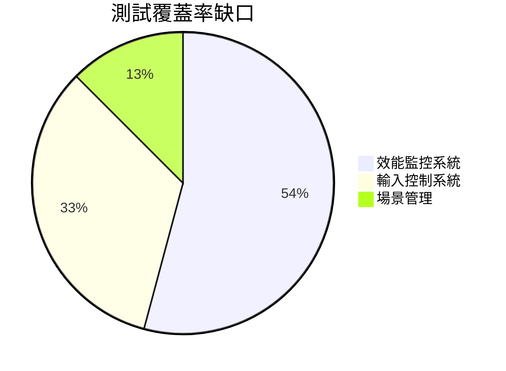

# 技術債務清單 v0.01

## 架構層面
- ~~未實現網路同步時序圖~~ → 需補齊WebSocket握手流程圖
- 場景管理系統缺乏狀態轉移圖
- 物理引擎碰撞檢測未分層處理
- 動畫系統資源載入時序問題 (已於v0.02修正)

## 代碼品質
- [高優先級] DynamicWindowAdjuster.ts 缺乏JSDoc
- [中優先級] MainScene.ts 縮排不一致問題
- [緊急] 全域錯誤處理中間件未實作

## 測試缺口

## 技術決策待辦
1. 選擇CI/CD服務商（GitHub Actions vs GitLab CI）
2. 評估SonarQube導入成本
3. 決定Electron封裝時機點